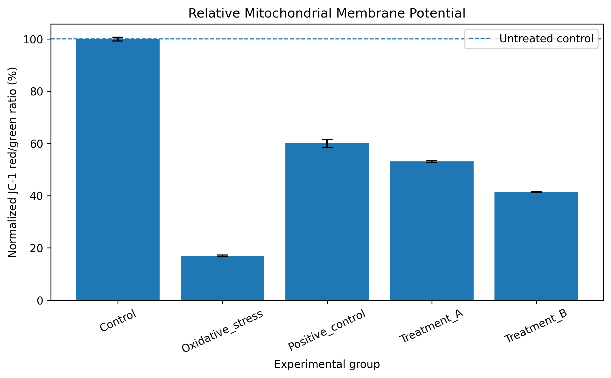

# Neuronal-Cell-Image-Analysis
Quantitative image analysis of SH-SY5Y neuronal cells for oxidative stress, mitochondrial function, and neuroprotection studies using Python and ImageJ/Fiji.
## Quantitative Analysis of Neuronal Cell Imaging Data

This repository contains workflows for quantitative analysis of cellular
fluorescence microscopy data, with a focus on neuronal models of oxidative
stress and neuroprotection.

The project demonstrates the integration of biological imaging with
quantitative and computational analysis using ImageJ/Fiji and Python.

### Analysis workflows

- Fluorescence image preprocessing
- Background correction
- Region-of-interest (ROI) based measurements
- Quantification of fluorescence intensity
- Mitochondrial membrane potential analysis
- Red/green fluorescence ratio analysis
- Normalization across experimental groups
- Statistical analysis and visualization
- Reproducible processing of biological replicates

### Tools

- ImageJ / Fiji
- Python
- NumPy
- Pandas
- Matplotlib
- SciPy
# Neuronal Cell Image Analysis

A reproducible computational workflow for quantitative analysis of fluorescence
microscopy data from neuronal cell models.

This repository demonstrates the integration of biological imaging, image
processing, quantitative fluorescence analysis, and Python-based data analysis
for investigating oxidative stress, mitochondrial function, and neuroprotection.

## 🧠 Biological Context

Fluorescence microscopy provides quantitative information about cellular
responses that may not be captured by visual inspection alone. This project
focuses on converting neuronal fluorescence microscopy measurements into
reproducible quantitative datasets for downstream biological interpretation.

## 🔬 Current Analysis Workflows

### 1. Fluorescence Image Analysis

`src/image_analysis.py`

The workflow includes:

- Loading fluorescence microscopy images
- Grayscale intensity extraction
- Background estimation and correction
- Mean fluorescence intensity calculation
- Batch processing of microscopy images
- Export of quantitative measurements to CSV

### 2. JC-1 Mitochondrial Membrane Potential Analysis

`src/jc1_analysis.py`

JC-1 fluorescence can be used to assess changes in mitochondrial membrane
potential through the ratio of red to green fluorescence.

The workflow includes:

- Red and green fluorescence measurements
- Background-corrected signal analysis
- Calculation of JC-1 red/green fluorescence ratio
- Normalization relative to untreated controls
- Comparison of experimental treatment groups

## 🛠️ Tools and Technologies

- Python
- NumPy
- Pandas
- Pillow
- ImageJ/Fiji
- Fluorescence microscopy
- Quantitative image analysis

## 📁 Repository Structure

    Neuronal-Cell-Image-Analysis/
    │
    ├── src/
    │   ├── image_analysis.py
    │   └── jc1_analysis.py
    │
    ├── README.md
    └── requirements.txt

## 🎯 Research Applications

This workflow can support quantitative investigation of:

- Oxidative stress
- Mitochondrial dysfunction
- Neurotoxicity
- Neuroprotection
- Cellular responses to experimental treatments

## 🔄 Planned Development

Future versions will include:

- Automated region-of-interest analysis
- Multi-channel fluorescence image processing
- Statistical comparison of experimental groups
- Publication-quality visualization
- Example datasets for reproducible demonstration
- Additional neuronal imaging workflows

## ⚠️ Data Availability

The repository contains computational workflows and demonstration data only.
Unpublished experimental datasets and raw microscopy images are not publicly
distributed.
## ▶️ Run the Analysis

Install the required Python packages:

```bash
pip install -r requirements.txt
```
Run the complete JC-1 analysis workflow:

```bash
python run_analysis.py
```

The workflow automatically:

1. Loads the synthetic JC-1 fluorescence dataset
2. Calculates the JC-1 red/green fluorescence ratio
3. Normalizes values relative to the untreated control
4. Calculates group summary statistics
5. Generates a visualization of relative mitochondrial membrane potential

### Output Files

The analysis generates:

- `results/jc1_processed_results.csv`
- `results/jc1_group_summary.csv`
- `results/jc1_normalized_membrane_potential.png`
## 📊 Example Output

The figure below demonstrates the JC-1 analysis workflow using the synthetic example dataset.



*Example visualization generated from synthetic demonstration data. Values do not represent experimental research results.*

##👩‍🔬 Author

**Sharmistha Dutta**

PhD Researcher | Computational Biology | Machine Learning | Neurobiology |
Quantitative Bioimage Analysis
